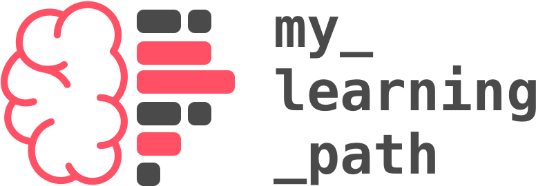

Hello there! Wellcome to my_learning_path

### What is this?
I created my_learning_path as a github organization to make room for my personal experiments and learnings as a web developer.

As a designer coming to the code side, I've been trying different courses and online resources in a daily basis. After awhile I noticed that my main github profile @ronalson was getting a bit messy. So my idea here is to make this org the home for my coding studies.

As a side effect: I hope to help others starting in this field with some insights on how to manage and plan their developer path.

### What will you find here?

- mostly online courses exercises
- some finished projects
- random crazy experiments with things that I don't really understand (or do I?)
- links and resources that I think are worth sharing
- cheatsheets, diagrams and notes that I use while studying
- review of books and courses

---

Credits: [left brain](https://thenounproject.com/search/?q=brain&i=872845) by Alina Oleynik from the Noun Project
